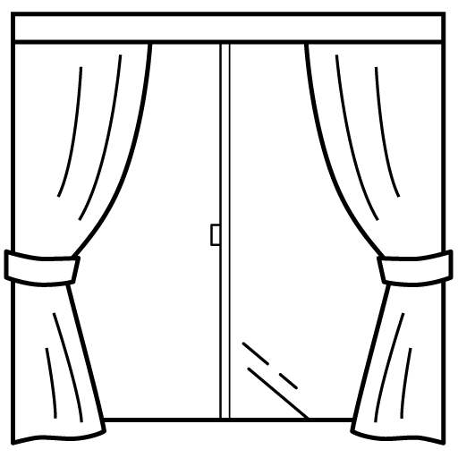

<h1 align="center">カーテン自動開閉装置コントロールパネル</h1>
<h2>概要</h2>

カーテン自動開閉装置は指定した時間にカーテンを自動で開閉することができます。 これはそのコントロールパネル(<a href="https://curtain.harehare1554.net/">https://curtain.harehare1554.net/</a>)のソースコードです。

<h2>クレジット</h2>

協力　　　： ロゴ制作　：母 参考サイト：PHPで簡単なWebAPIを実装してみる【初心者向け】｜kazz　(<a href="https://note.com/kazztech/n/ndb3a5468f299">https://note.com/kazztech/n/ndb3a5468f299</a>) 　　　　　：ローディングのくるくる - とりとめないメモ。　(<a href="https://lopan.jp/memorandum/loading-circle/">https://lopan.jp/memorandum/loading-circle/</a>) 　　　　　：サイトをアプリ化するPWAとは？作り方と動作イメージを併せて紹介 - メタルドラマーのIT備忘録（IT memorandum by a metal drummer）　(<a href="https://wellknowledge.org/pwa/">https://wellknowledge.org/pwa/</a>) 　　　　　：【PHP】inputタグのvalue属性に値を設定する方法を解説 _ ウェブカツBLOG　(<a href="https://webukatu.com/wordpress/blog/39366/">https://webukatu.com/wordpress/blog/39366/</a>)

